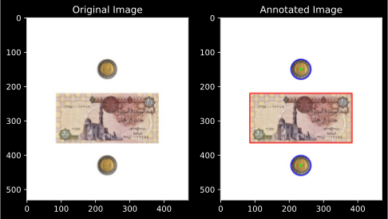
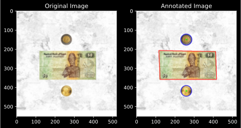
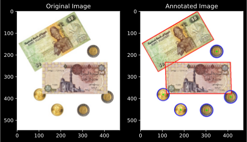
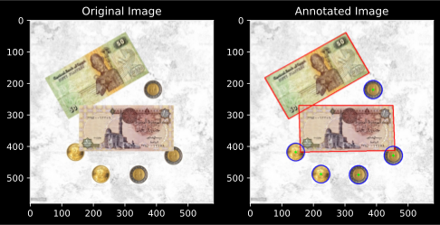

<center><bold>Assignment 2</bold></center>
<center>Mohamed A. AbdelHamed - 900163202</center>
<center>oscar@aucegypt.edu</center>

# Overview:
Presented is a Hough line and circle detector implemented in Python. It is designed to work on monetary tokens (coins and papernotes) by recognizing circles and rectangles.

# Methodology:
The main process for this geometric detection is as follows:  
1. Apply a median blur to the image to smooth out the noise.  
2. Apply Canny edge detection to the image to get the gradient version.  
3. Apply circle transform to detect circular coins.
4. Apply Hough line transform to extract straight lines.  
5. Get all possible 4-tuples of lines and compare their angle difference to detect if they form a rectangle.  
6. Pinpoint rectangle corner points.  
7. Draw the detected circles and rectangles for verification.  
8. Tune thresholds if needed and repeat.

# How to run:  
Running the program is quite simple:  
1. In case of new test cases, they should be added to `./test_cases` named `case*i*.jpg` (without the *) where i is the case number.  
2. Run the ``main.run(case_ids)`` function where `case_ids` is a list of case numbers of cases you wish to test.  
3. After observing the results, start tuning detection hyperparameters `LINE_THRESHOLD`, `CIRC_THRESHOLD` to improve line (hence rectangle) and circle detection, respectively. Those two parameters can be found in `main.py`.

# Showcase:
We now apply the process for coin and papernote detection on the following 4 cases:  
### Case (a): 2 coins and 1 paper note non-overlapping on a plain background


```python
from main import run
run(case_ids=[1])
```


    

    


    

    


### Case (b): 2 coins and 1 paper note non-overlapping on a noisy background


```python
from main import run
run(case_ids=[2])
```


    

    


    

    


### Case (c): 5 coins and 2 paper notes with partial overlap on a plain background


```python
from main import run
run(case_ids=[3])
```


    

    


    

    


### Case (d): 5 coins and 2 paper notes non-overlapping on a noisy background


```python
from main import run
run(case_ids=[4])
```


    

    


    

    

